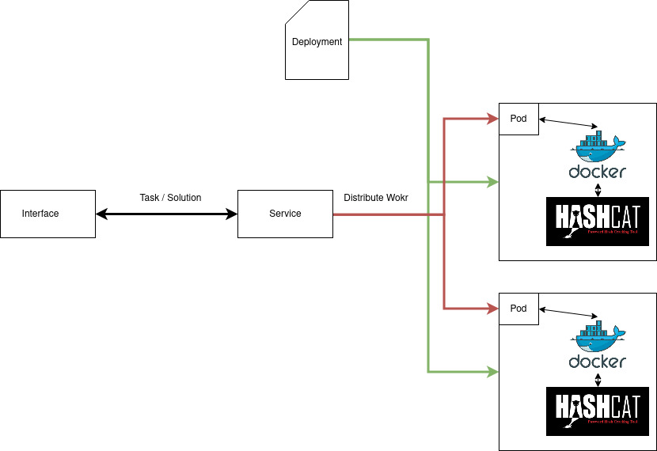

= Zadani

Zadáním bakalářské práce je vytvoření výpočetního clusteru, který bude řízen za pomoci Kubernetes.
Jednotlivé nody, které budou specifikovány v daném souboru, budou moci být přidány a odebrány dle potřeby.
Tyto výpočetní nody budou mít nainstalovaný linuxový operační systém a budou zajistěné fakultou.
Nody se budou přípravovat pomocí technologií Ansible, která usnadní konfiguraci nodů.
Na tomto vytvořeném clusteru dále bude spuštěno lámání hesel.
A to takovým způsobem, že master node bude předávat práci workerům.
Ty budou následně ve vytvořeném docker containeru crackovat přidělenou práci a vrátí mastru výsledky crackování.
O crackování se bude starat software jménem hashcat, který může být optimalizovaný i na grafické karty.
Budou se crackovat zejména sha1 hashe a to pomocí bruteforce útoků, slovníkových útoků a útoků s maskou.
Výkonost jednotlivých metod na crackování následně bude porovnána a její rychlost analyzována.

== Práce bý měla zahrnovat

. Popis a analýza použitých technologií (Kubernetes, Ansible, Docker, hashcat).
. Vytvoření a popis sestaveného clusteru.
. Popis různých útoků a analýza nejčastěji používaných hesel.
. Spoustění softwaru s různými metody útoku (bruteforce, slovíkový, mask).
. Analýza výsledku rychlosti crackování.

== Podobná řešení

Jako příklad podobného řešení mohu najít zde:

:link: https://github.com/psinghal20/distributed-cracker[Go].

V repozitáři je rešení podobnéhu úkolu ovšem pouze pomoci jazyka go.

Další opensource řešení je hashtopus:

:link: https://github.com/curlyboi/hashtopus[Hastopus].

Autor však uvádí, že jeho řešení je již zastaralé a odkazuje na jiné.

CrackLord je řešení, které se nejvicé podobá tomu, co bych chtěl řešit já.
Pomocí fornty servírují vstup od uživatele zdrojům, které mají nakonfigurované nástroje, tak aby je mohli řešit.
Rozdíl mezi touto implmentací je v tom, že mě nebude spravovat queue program psaný v jazyce GO,
ale Kubernetes. Moje zdroje budou Docker kontejnery.
Nanich bude nainstalovaný hashcat, který se postará o samotné lámání.

:link: http://jmmcatee.github.io/cracklord/[CrackLord].

:link: https://github.com/jmmcatee/cracklord[CrackLord-git].

== Nástřel řešení

